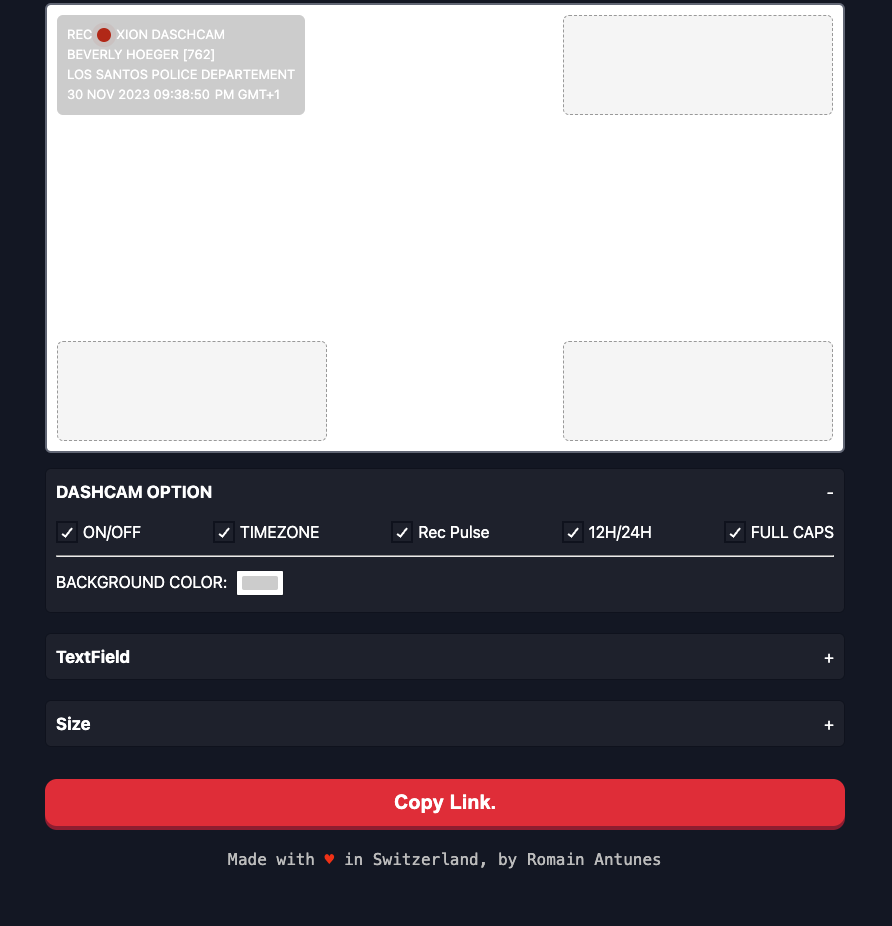

# FiveM Bodycam Overlay Generator

## Overview

This is a FiveM Bodycam Overlay Generator, built with Vite, React, TypeScript, ESLint, and Prettier. It provides a seamless development environment for creating bodycam overlays for use in the FiveM platform.

## Getting Started

To set up the development environment, follow these steps:

1. Clone the repository: `git clone https://github.com/RomainAntunes/fivem-bodycam-overlay`
2. Navigate to the project directory: `cd fivem-bodycam-overlay`
3. Install dependencies: `npm install` or `yarn install`

# Image



## Scripts

- **dev:** Start the development server with Vite.
  ```bash
  npm run dev
  ```
- **build:** Build the project for production.
  ```bash
  npm run build
  ```
- **serve:** Preview the production build locally.
  ```bash
  npm run serve
  ```
- **lint:fix:** Automatically fix linting issues.
  ```bash
  npm run lint:fix
  ```
- **lint:format:** Format code using Prettier.
  ```bash
  npm run lint:format
  ```
- **lint:** Run both lint:format and lint:fix.
  ```bash
  npm run lint
  ```
- **type-check:** Run TypeScript type checking.
  ```bash
  npm run type-check
  ```

## Dependencies

- [@headlessui/react](https://www.npmjs.com/package/@headlessui/react): ^1.0.0
- [autoprefixer](https://www.npmjs.com/package/autoprefixer): ^10.2.5
- [chokidar-cli](https://www.npmjs.com/package/chokidar-cli): ^2.1.0
- [cookie](https://www.npmjs.com/package/cookie): ^0.4.1
- [faker](https://www.npmjs.com/package/faker): ^5.5.3
- [formik](https://www.npmjs.com/package/formik): ^2.2.6
- [i18next](https://www.npmjs.com/package/i18next): ^20.2.2
- [node-sass](https://www.npmjs.com/package/node-sass): ^5.0.0
- [npm-run-all](https://www.npmjs.com/package/npm-run-all): ^4.1.5
- [postcss](https://www.npmjs.com/package/postcss): ^8.2.15
- [query-string](https://www.npmjs.com/package/query-string): ^7.0.0
- [react](https://www.npmjs.com/package/react): ^17.0.2
- [react-color](https://www.npmjs.com/package/react-color): ^2.19.3
- [react-cookie](https://www.npmjs.com/package/react-cookie): ^4.0.3
- [react-custom-checkbox](https://www.npmjs.com/package/react-custom-checkbox): 3.1.5
- [react-dom](https://www.npmjs.com/package/react-dom): ^17.0.0
- [react-hot-toast](https://www.npmjs.com/package/react-hot-toast): ^1.0.2
- [react-i18next](https://www.npmjs.com/package/react-i18next): ^9.0.10
- [react-input-slider](https://www.npmjs.com/package/react-input-slider): ^6.0.0
- [react-router-dom](https://www.npmjs.com/package/react-router-dom): ^5.2.0
- [react-select](https://www.npmjs.com/package/react-select): ^4.3.0
- [react-tooltip](https://www.npmjs.com/package/react-tooltip): ^4.2.17
- [sass](https://www.npmjs.com/package/sass): ^1.32.8
- [styled-component](https://www.npmjs.com/package/styled-component): ^2.8.0
- [styled-components](https://www.npmjs.com/package/styled-components): ^5.2.3
- [tailwindcss](https://www.npmjs.com/package/tailwindcss): ^2.1.1
- [use-clipboard-copy](https://www.npmjs.com/package/use-clipboard-copy): ^0.2.0

## Dev Dependencies

- [@types/cookie](https://www.npmjs.com/package/@types/cookie): ^0.4.0
- [@types/faker](https://www.npmjs.com/package/@types/faker): ^5.5.4
- [@types/node-sass](https://www.npmjs.com/package/@types/node-sass): ^4.11.1
- [@types/react-color](https://www.npmjs.com/package/@types/react-color): ^3.0.4
- [@types/query-string](https://www.npmjs.com/package/@types/query-string): ^6.3.0
- [@types/react](https://www.npmjs.com/package/@types/react): ^17.0.5
- [@types/react-cookies](https://www.npmjs.com/package/@types/react-cookies): ^0.1.0
- [@types/react-dom](https://www.npmjs.com/package/@types/react-dom): ^17.0.0
- [@types/react-router-dom](https://www.npmjs.com/package/@types/react-router-dom): ^5.1.7
- [@types/react-select](https://www.npmjs.com/package/@types/react-select): ^4.0.15
- [@types/styled-components](https://www.npmjs.com/package/@types/styled-components): ^5.1.9
- [@typescript-eslint/eslint-plugin](https://www.npmjs.com/package/@typescript-eslint/eslint-plugin): ^4.17.0
- [@typescript-eslint/parser](https://www.npmjs.com/package/@typescript-eslint/parser): ^4.17.0
- [@vitejs/plugin-react-refresh](https://www.npmjs.com/package/@vitejs/plugin-react-refresh): ^1.3.1
- [eslint](https://www.npmjs.com/package/eslint): ^7.22.0
- [eslint-config-prettier](https://www.npmjs.com/package/eslint-config-prettier): ^8.1.0
- [eslint-plugin-import](https://www.npmjs.com/package/eslint-plugin-import): ^2.22.1
- [eslint-plugin-jsx-a11y](https://www.npmjs.com/package/eslint-plugin-jsx-a11y): ^6.4.1
- [eslint-plugin-prettier](https://www.npmjs.com/package/eslint-plugin-prettier): ^3.3.1
- [eslint-plugin-react](https://www.npmjs.com/package/eslint-plugin-react): ^7.22.0
- [eslint-plugin-simple-import-sort](https://www.npmjs.com/package/eslint-plugin-simple-import-sort): ^7.0
